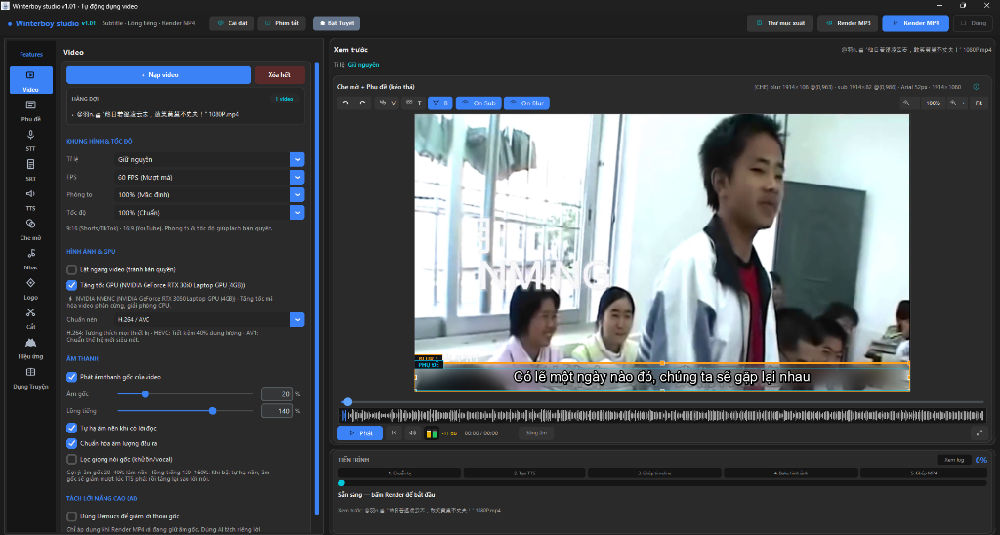

# Winterboy Studio - Open Source Edition ❄️

**Phiên bản: v1.2**

Chào các đạo hữu,

Sau một thời gian mò mẫm reverse engineer các tool trên những group MMO, cuối cùng mình cũng hiểu được workflow phía sau cách các tool làm video hoạt động.

Vì vậy mình build Winterboy Studio - một bộ công cụ tương đối đầy đủ để hỗ trợ các nhà sáng tạo nội dung, editor và TikToker trong quá trình làm video.

Do mình học An toàn thông tin và cũng không quá giỏi code nên project có khá nhiều đoạn được vibe code. Tuy nhiên, phần cốt lõi về workflow và các chức năng chính thì mình đã hoàn thiện tương đối đầy đủ.

Mình quyết định open-source Winterboy Studio để mọi người có thể dùng chung. Bác nào hứng thú muốn nghiên cứu, customize hoặc phát triển thêm thì cứ fork về làm tiếp.

Hy vọng project có thể hữu ích cho anh em.



---

## 🌟 Các tính năng nổi bật (Features)

1. **Auto Subtitle (Phụ đề tự động & Dịch thuật)**:
   - Nhận diện giọng nói STT (Speech-to-Text) thông qua Whisper / CapCut / ZeroTTS.
   - Dịch phụ đề tự động bằng AI (Gemini / Google Translate).
   - Chỉnh sửa, xuất/nhập file SRT dễ dàng.

2. **Text-To-Speech (Lồng tiếng AI - TTS)**:
   - Tích hợp rất nhiều Engine lồng tiếng: CapCut TTS, Edge TTS, ElevenLabs, ZeroTTS, VietneuTTS(clone voice).
   - Kho giọng CapCut cloud mở khoá: **24 giọng tiếng Việt** (và 103 giọng ngôn ngữ khác) nạp thẳng vào dropdown, xem mục [Danh sách giọng CapCut](#-danh-sách-giọng-capcut-voice-catalog).
   - Cho phép tinh chỉnh tốc độ, âm lượng, ghép nối audio khớp với timeline video.

3. **Chỉnh sửa Video & Render (Video Editor)**:
   - Che mờ (Blur) thông minh, làm mờ vùng chỉ định.
   - Cắt ghép (Trim) video đa phân đoạn.
   - Chèn Logo, Watermark tùy chỉnh có hiệu ứng chuyển động.
   - Tối ưu hóa render bằng FFmpeg (GPU Acceleration) cho tốc độ xuất cực nhanh.

4. **Story AI Creator (Tạo video tự động)**:
   - Dựng video hoàn toàn tự động dựa trên prompt và tài nguyên có sẵn.
   - Tự động tách nền (Vocal / BGM Separation) sử dụng thuật toán Demucs (AI).
   - Tự chọn nhạc nền (BGM), trộn âm lượng (Audio ducking) thông minh.

5. **Chống quét bản quyền (Bypass / Reup MMO)**:
   - Các thuật toán xử lý video chuyên sâu: xáo trộn Subpixel, thêm nhiễu (Noise), đổi Colorspace.
   - Can thiệp tốc độ (Tempo), khung hình (GOP), thay đổi Zoom/Pan động (Dynamic motion) để né thuật toán dò trùng lặp.
   - Chế độ **Ultimate Bypass** giúp lách bản quyền nền tảng (TikTok, YouTube), tạo ra video 100% unique cho dân Reup.

---

## 📥 Tải về và sử dụng ngay (Không cần cài đặt)
Bạn không cần phải biết code hay tự build lại phần mềm! Chỉ cần tải bản đóng gói sẵn (.exe) và sử dụng ngay:
1. Nhấn vào mục **[Releases]** ở menu bên phải của trang GitHub này (hoặc biểu tượng tag).
2. Tải về file `WinterboyStudio_OpenSource_Release.zip`.
3. Giải nén ra một thư mục bất kỳ.
4. Chạy file `WinterboyStudio.exe` để bắt đầu làm việc!

> **Về số phiên bản hiển thị trong giao diện.** `__version__` khai báo một chỗ duy
> nhất ở `app/__init__.py` (hiện là `1.2`). Chuỗi `v1.01` bạn còn thấy trên tiêu đề
> cửa sổ, badge trên header và hộp Cài đặt đến từ `main_window.pyc` /
> `settings_dialog.pyc`: thân hai module đó chưa được khôi phục xong trong source
> (`main_window.py` mới có 1/207 code object), nên chưa có chỗ để đổi chữ trong
> source. Đây là điểm khác biệt giữa "mã nguồn" và "bản đã build" cần nói thẳng,
> không phải chỗ bị bỏ quên — nó sẽ khớp khi build lại từ source bằng `build.bat`.

---

## 🚀 Dành cho nhà phát triển (Chạy từ mã nguồn)

### Yêu cầu hệ thống:
- Hệ điều hành: Windows 10 / 11.
- Môi trường: Python 3.10 đến 3.12 (bản đã phát hành biên dịch bằng 3.12).
- FFmpeg (phải có trên `PATH` để render video).

### Các bước chạy code:
1. **Tải mã nguồn**: Clone repository này về máy.
   ```bash
   git clone https://github.com/tinhatinh/Winterboy-Studio.git
   cd Winterboy-Studio
   ```
2. **Cài đặt thư viện**:
   ```bash
   pip install -r requirements.txt
   ```
   `tkinter` KHÔNG cần cài vì nó đi kèm CPython. Các nhóm nặng (torch/onnxruntime
   cho ZeroTTS, demucs cho tách lời) có chú thích riêng trong `requirements.txt`.
3. **Kiểm tra mã nguồn trước khi sửa**:
   ```bash
   python tools/check_source.py --damaged --parity   # cổng kiểm tổng
   python tests/run_tests.py                         # bộ test đối chiếu
   ```
4. **Khởi chạy ứng dụng**:
   ```bash
   python main.py
   ```
   **Hiện vẫn chưa chạy được từ source, nói thẳng để bạn khỏi mất công debug.**
   Tính tới bản này, `app/ui/main_window.py` mới khôi phục được 1/207 code object
   nên cửa sổ chính còn trống; `import main` thì OK nhưng nạp `app.ui.control_panel`
   sẽ fail. Muốn dùng ngay, tải Release zip ở mục trên. Muốn đóng góp, hãy sửa các
   module theo quy trình dưới rồi chạy `tools/audit_installed_app.py` — tool này dựng
   thật cửa sổ của **bản đã cài** nên bắt được cả lỗi mà `import` không lộ.

### ⚠️ Trạng thái mã nguồn, nói thẳng

Repo này được **dịch ngược từ bytecode** (`.pyc`) của bản đã phát hành bằng
Decompyle++, không phải mã gốc tác giả viết. Hệ quả thật sự:

- Một số file ra mã **không phải Python hợp lệ** (`SrtCue = <NODE:12>()`, `None =`
  trong `except`, `getattr(...) = ...`).
- Nguy hiểm hơn, nhiều hàm **parse bình thường nhưng chạy sai** — ví dụ đã bắt được:
  `duration_s` mất `max(0.05, ...)`, `record()` mất giá trị mặc định của `save` nên
  mọi lời gọi nổ `TypeError`, `file_dependency` mất vòng đọc theo khối.
- Vì vậy "file nằm trong repo" ≠ "file đó chạy được như bản Release".

Cách làm việc đang dùng: **lấy bytecode làm chuẩn**, không đoán.
`tools/compare_bytecode.py` biên dịch file trong repo rồi so từng code object với
`.pyc` đã phát hành — khớp ở tầng instruction thì hành vi chắc chắn giống, không cần
gọi mạng. Quy trình đầy đủ ở [`docs/restore_from_bytecode.md`](docs/restore_from_bytecode.md).

Số liệu thay đổi liên tục trong lúc khôi phục, nên repo không ghi cứng. Muốn biết
tình trạng hiện tại, chạy đúng hai lệnh này:

```bash
python tools/compare_bytecode.py --all    # dòng đầu: bao nhiêu module khớp bytecode 100%
python tests/run_tests.py                 # dòng cuối: bao nhiêu test pass/fail
```

`tools/check_source.py` cho biết còn bao nhiêu file chưa parse được.

Nếu bạn chỉ muốn **dùng**, tải Release zip ở mục trên. Nếu muốn **đóng góp mã nguồn**,
sửa theo quy trình trong `docs/restore_from_bytecode.md` và chạy hai cổng kiểm ở bước 3
trước khi mở PR — sửa xong mà `compare_bytecode` vẫn báo lệch thì coi như chưa xong.

---

## 🗣️ Danh sách giọng CapCut (Voice catalog)

Engine CapCut TTS đọc kho giọng từ **`app/services/capcut_voices.json`**. Có file là dropdown
trong ứng dụng hiện đầy đủ giọng, không cần sửa code; thiếu file thì chỉ còn 1 giọng mặc định.

Bản đang có trong repo: **127 giọng / 10 ngôn ngữ** (en-US 40, **vi-VN 24**, ja-JP 19, zh-CN 15,
es-ES 9, th-TH 6, id-ID 4, pt-BR 4, de-DE 3, fr-FR 3), xếp tiếng Việt lên đầu.

24 giọng tiếng Việt — `voice_type:resource_id` nằm trong file JSON:

> Alex Đại Đế · Ban Mai · Bản Tin 1 · Bản Tin nữ · Cô Gái Hoạt Ngôn · Giọng Bé · Giọng Gái Mới Lớn ·
> Giọng Nam Trầm · Giọng Nữ Phổ Thông · Kenny Đại Đế · Mai · Nam bản tin · Nhỏ Ngọt Ngào ·
> Quên Tên Tự Test · Review Phim 2 · Review Phim 3 · Review Phim 4 · Review Phim new · Robot VN ·
> Sunny Idol · Thanh Niên Tự Tin · Việt Méo · Hoai My · Nam Minh

Dòng định dạng mỗi phần tử (thừa khoá thì engine bỏ qua):

```json
{
  "display_name": "Nhỏ Ngọt Ngào",
  "voice_type": "BV421_vivn_streaming",
  "resource_id": "7252594014782755330",
  "lang": "vi-VN",
  "lan": "vi",
  "captured_at": "2026-04-16T16:54:58.535653",
  "verified": true
}
```

### Kiểm chứng giọng nào thực sự sinh được audio

Catalog chỉ là danh sách do CapCut trả về; có giọng bị gắn quyền riêng nên gọi vẫn nhận `failed`
(Hoai My và Nam Minh trong danh sách trên là hai giọng như vậy, đã đánh dấu `"verified": false`).
Chạy tool để dò lại và ghi kết quả vào file:

```bash
python tools/verify_capcut_voices.py --lang vi --write
# bản đã cài đặt (bỏ qua mã nguồn chưa hoàn chỉnh):
python tools/verify_capcut_voices.py --lang vi --write --engine "C:/WinterboyStudio/_internal"
```

### Lưu ý khi build

`build.bat` đã truyền `--add-data "app/services/capcut_voices.json;app/services"` để file nằm đúng
chỗ `_internal/app/services/` trong bản đóng gói. Ngoài ra cần device profile thật ở
`~/.winterboy/capcut_device.json`, nếu không CapCut sẽ trả `shark block only` (chống bot).

---

## ⚖️ Giấy phép (License)
Dự án được giải phóng mã nguồn mở hoàn toàn nhằm mục đích học tập, nghiên cứu và phát triển cộng đồng (Community Fork). Mọi người đều có thể tự do phát triển thêm tính năng, đóng góp mã nguồn mà không lo ngại vấn đề giới hạn bản quyền gốc.
